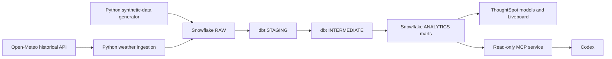
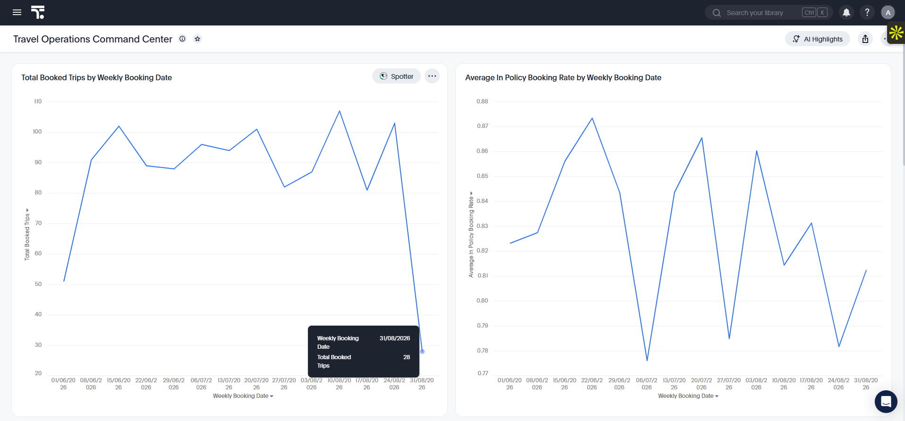
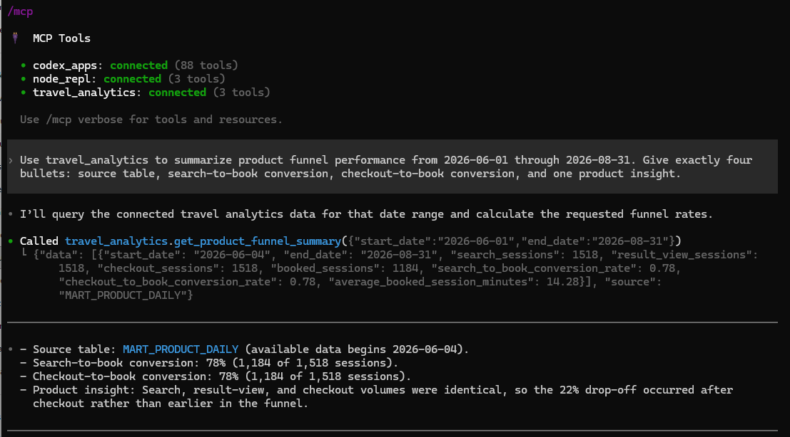

# TravelOpsIQ

**Governed travel product and operations analytics, from raw events to
self-service insights and a read-only AI interface.**

TravelOpsIQ is an independent, end-to-end analytics engineering portfolio
project. It models a business-travel journey across booking, policy, spend,
expenses, and support, then makes trusted KPIs available through ThoughtSpot
and a constrained Model Context Protocol (MCP) service.

> Core travel, expense, policy, and support data is deterministic and
> synthetic. A separate enrichment flow retrieves public historical weather
> observations from Open-Meteo. The project contains no customer data and does
> not integrate with any third-party travel platform.

## What it demonstrates

- Python ingestion and deterministic synthetic-data generation
- Snowflake schema design and least-privilege service identities
- dbt staging, intermediate, fact, dimension, and daily mart models
- Automated data-quality tests and repeatable local validation
- ThoughtSpot semantic models and a six-chart operations Liveboard
- A local MCP server that exposes approved, parameterized aggregate queries
- Live public-weather ingestion, transparent risk classification, and a
  governed travel-risk mart

## Architecture



## Portfolio previews

### ThoughtSpot operations Liveboard

The **Travel Operations Command Center** makes trusted product and operations
KPIs available as self-service weekly trends.



### Read-only MCP analytics interface

Codex discovers the local `travel_analytics` MCP server and invokes only its
approved product-funnel, operations-summary, and KPI-trend tools.



## Key analytics outputs

The governed daily marts answer questions such as:

- Where does the booking funnel lose travelers?
- How do booking volume and conversion move over time?
- How much spend occurs outside policy?
- Which periods have elevated support-contact rates or resolution time?
- Which historical departure dates had meaningful destination-weather exposure?

The ThoughtSpot **Travel Operations Command Center** includes trends for booked
trips, in-policy booking rate, out-of-policy spend, search-to-book conversion,
checkout-to-book conversion, and booked-session volume.

## Live weather enrichment

The optional weather flow enriches synthetic trip destinations with public
historical observations from the [Open-Meteo Historical Weather
API](https://open-meteo.com/en/docs/historical-weather-api). It sends only
version-controlled city coordinates and date ranges to the API—never trip IDs,
employee IDs, booking details, or expense data.

`MART_TRAVEL_RISK_DAILY` provides daily aggregate metrics including
weather-impacted trip rate, high-risk trips, and booking value exposed to
medium/high weather conditions. Risk is a transparent portfolio proxy based on
weather severity, wind, and precipitation; it is not a claim of actual flight
disruption. See the [live-weather runbook](docs/12_live_weather_enrichment.md)
for the source contract and reproducible commands.

## Governed AI access

The MCP service is intentionally constrained:

- Its Snowflake role has `USAGE` on the warehouse, database, and analytics
  schema plus `SELECT` on only two daily KPI marts.
- It has no access to RAW, STAGING, INTERMEDIATE, or employee-level data.
- It exposes no arbitrary SQL tool.
- All dates are validated and all SQL values are parameterized.

The available tools are `get_product_funnel_summary`,
`get_operations_summary`, and `get_kpi_trend`.

## Technology

| Area | Tools |
| --- | --- |
| Data generation and ingestion | Python, pandas, Faker, Snowflake Connector, Open-Meteo API |
| Transformation and testing | SQL, dbt, dbt-snowflake |
| Warehouse | Snowflake |
| Business intelligence | ThoughtSpot |
| AI integration | MCP Python SDK, Codex |
| Quality checks | pytest, dbt tests |

## Project structure

```text
dbt/       dbt models, tests, macros, and source definitions
docs/      architecture notes, setup runbooks, and demo guide
scripts/   repeatable developer checks and local commands
sql/       Snowflake bootstrap and least-privilege role scripts
src/       synthetic data, ingestion, and MCP application code
tests/     Python unit tests
```

## Reproduce locally

Follow the documentation in order:

1. [Environment setup](docs/01_setup.md)
2. [Metric contract](docs/02_project_charter.md)
3. [Snowflake foundation](docs/03_snowflake_bootstrap.md)
4. [Python data generation and RAW ingestion](docs/05_synthetic_data.md)
5. [dbt transformations and governed marts](docs/07_dbt_staging.md)
6. [ThoughtSpot setup](docs/09_thoughtspot_setup.md)
7. [Read-only MCP service](docs/10_read_only_mcp.md)

For the completed five-minute walkthrough, use the
[interview demo runbook](docs/11_interview_demo.md).

## Verification evidence

- Synthetic-data unit test: `1 passed`
- Full dbt build: `69` passing checks
- MCP query-policy tests: `4 passed`
- MCP protocol discovery: three advertised tools
- End-to-end MCP calls: product summary, operations summary, and daily trend

## Production hardening next steps

- Use Snowflake key-pair or workload-identity authentication instead of local
  passwords.
- Store secrets in a vault and deploy the MCP service behind authenticated
  Streamable HTTP.
- Add CI for Python tests, dbt tests, and model contracts.
- Add freshness monitoring, warehouse cost controls, and alerting.

## Security note

Never commit `.env`, passwords, tokens, generated exports, dbt artifacts, or
local editor configuration. The included `.gitignore` excludes these files.
