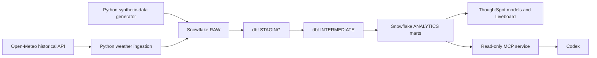

# Interview demo runbook

## One-sentence project summary

I built a travel-operations analytics product: Python generates deterministic
source-shaped travel data and enriches it with public historical weather,
Snowflake stores it, dbt tests and transforms it into governed marts,
ThoughtSpot provides self-service dashboards, and a local MCP service exposes
a small read-only analytics interface to Codex.

## Architecture



## Five-minute walkthrough

### 1. Start with the business problem — 30 seconds

"Product and Operations needed one trusted view of booking conversion, policy
compliance, spend, support, and expenses. The source data is synthetic, but the
data-contract, transformation, security, and self-service patterns are the
same ones I would use for a real travel platform."

### 2. Show the engineering pipeline — 60 seconds

Point to `src/`, `dbt/`, `sql/`, `tests/`, and `docs/` in VS Code.

"Python owns repeatable synthetic ingestion and a separate public-weather
enrichment job. dbt owns the SQL transformations and data tests. I separated
RAW, STAGING, INTERMEDIATE, and ANALYTICS schemas so that business definitions
do not live in the ingestion code."

Mention verified evidence:

- Python generator test: `1 passed`.
- dbt full build: `69` passing checks.
- The analytics layer includes daily product, operations, and travel-risk
  marts: `MART_PRODUCT_DAILY`, `MART_OPERATIONS_DAILY`, and
  `MART_TRAVEL_RISK_DAILY`.

### 3. Show the ThoughtSpot Liveboard — 60 seconds

Open **Travel Operations Command Center**.

"The Liveboard is built from semantic models over daily marts, not directly
from raw tables. It shows booking demand, in-policy rate, out-of-policy spend,
search-to-book conversion, checkout-to-book conversion, booked-session volume,
and weather-exposure trends."

Call out a careful analytical observation:

"The final weekly volume dip is a partial-week artifact at the synthetic data
boundary, not evidence of a real demand collapse."

Call out the enrichment boundary:

"The travel events remain synthetic. The weather observations come from a
public historical API and are loaded separately. I send only city coordinates
and dates to that API—never trip IDs, employee data, or spend. The weather
risk metric is an exposure proxy, not a claim that flights were disrupted."

### 4. Show governance and security — 60 seconds

Open `sql/05_create_mcp_reader.sql`.

"The MCP identity has only five grants: warehouse, database, and schema usage,
plus SELECT on the two daily marts. It has no RAW, STAGING, INTERMEDIATE, or
employee-level access. The server also exposes no arbitrary SQL tool."

### 5. Show the MCP interaction — 90 seconds

In the Codex terminal, run `/mcp` and point out:

```text
travel_analytics: connected (3 tools)
```

Then show these verified results:

- Product funnel: 1,184 booked sessions from 1,518 search sessions; weighted
  search-to-book conversion `78%`.
- Operations: `$1,560,413.78` gross booking value, `82.6%` in-policy rate,
  `$271,254.45` out-of-policy spend, and `13.09%` support-contact rate.
- Trend: peak daily out-of-policy spend of `$12,342.81` on `2026-07-08`.

Close with: "The assistant can answer a small set of approved questions, but
the policy boundary is enforced in both Snowflake privileges and Python's
allow-listed, parameterized query templates."

## Likely interview questions

### Why not let the AI run arbitrary SQL?

Arbitrary SQL makes it harder to control data access, cost, query safety, and
metric consistency. The MCP uses fixed, parameterized queries over curated
marts. Adding a new business question requires code review and a test.

### Why calculate rates as weighted ratios?

For a multi-day period, I calculate total numerator divided by total denominator
instead of averaging daily percentages. That avoids giving a low-volume day the
same influence as a high-volume day.

### Why separate the dbt user, ThoughtSpot user, and MCP user?

They have different jobs and privileges. A dbt developer identity creates
models; ThoughtSpot reads governed analytics; MCP reads only two daily marts.
This makes least privilege auditable and limits blast radius.

### What would you change for production?

- Replace password authentication with Snowflake key-pair or workload identity.
- Store secrets in a vault, not a local `.env` file.
- Deploy the MCP service behind authenticated Streamable HTTP.
- Add CI for dbt tests, Python tests, and model contracts.
- Add freshness monitoring, cost limits, and alerting.

## Final evidence checklist

- [x] dbt connection works.
- [x] synthetic source data loads to Snowflake.
- [x] dbt build passes all 69 checks.
- [x] ThoughtSpot Liveboard contains six KPI trends.
- [x] Public historical-weather observations land in `RAW` and build into a
  governed travel-risk mart.
- [x] ThoughtSpot Liveboard includes a weekly weather-impacted-trip-rate trend.
- [x] ThoughtSpot uses its dedicated read-only account.
- [x] MCP role has only five intended grants.
- [x] MCP policy tests pass.
- [x] MCP protocol advertises three tools.
- [x] Codex calls all three tools successfully.
